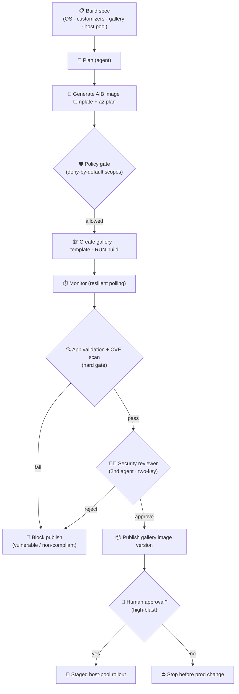

# 🏔️ Phase 9 Capstone — Atlas Imager: an agentic AVD image-build orchestrator

Build **Atlas Imager** — an agent that drives **Azure Virtual Desktop (AVD)** image
creation end-to-end: from a build spec → an **Azure VM Image Builder** template →
a built, generalized image → a versioned **Azure Compute Gallery** image → a
**staged host-pool rollout** — all **safe-by-default** (dry-run + human-approval gates).

This is the synthesis project: it uses *every* phase and the Advanced-Track toolkit.

> **Why this capstone?** It's a real, valuable Azure workflow (golden images for AVD),
> it's long-running and failure-prone (perfect for reliability), and it touches
> production (perfect for identity scoping + human-in-the-loop) — exactly the skills
> that separate a demo agent from a shippable one.

---

## 🧭 What it does (architecture)



Grounded in Microsoft docs: **Azure VM Image Builder** (managed, Packer-based;
source → customizers → distribute to Compute Gallery; auto-generalizes with sysprep;
templates are immutable; distribution uses a **user-assigned managed identity** with
least-privilege RBAC) and **AVD custom image templates** (built-in customizers:
FSLogix, Teams optimizations, RDP Shortpath, screen-capture protection, Windows
Updates, etc.).

## 🔒 Safety model (read this first)
- **Dry-run by default.** The agent *generates* the image template + `az` command
  plan and **simulates** results. It makes **no real Azure changes**.
- **Deny-by-default scopes.** Every tool call is authorized against the agent
  identity's granted scopes (`shared.policy`). Unknown/ungranted actions are denied.
- **Human-in-the-loop for high-blast.** Rolling session hosts (`update_host_pool`)
  always pauses for approval — the demo stops there.
- **Pre-publish security gate.** An **app validation + CVE scan** must pass before
  publishing; missing/forbidden apps and Critical/High CVEs (configurable) **block**
  the publish automatically (deny-by-default).
- **Two-key review (multi-agent).** A second, independent **security-reviewer agent**
  must also APPROVE before publish — both gates must pass (a two-person rule).
- **Least-privilege identity.** AIB distributes via a **user-assigned managed
  identity** scoped to the gallery RG — never Owner at subscription scope.
- Full **audit trail** + **trace** (span per operation) on every run.

## ▶ Run the demo (no Azure, no API key)
```powershell
python phase-9-capstone/avd_imager/agent.py
# or with your own spec:
python phase-9-capstone/avd_imager/agent.py phase-9-capstone/specs/win11-avd-multisession.json
# see the security gate BLOCK a vulnerable image (outdated app + High CVE + missing updates):
python phase-9-capstone/avd_imager/agent.py phase-9-capstone/specs/win11-avd-vulnerable.json
```
You'll see: spec validation → generated image template → `az` plan → policy-gated
execution → **app validation + CVE scan** → (publish only if it passes) → host-pool
approval gate → audit trail → trace → an ADR.

## 📁 Files
| File | Role |
| --- | --- |
| [`avd_imager/spec.py`](avd_imager/spec.py) | the build spec + validation (real AIB/AVD rules) |
| [`avd_imager/templates.py`](avd_imager/templates.py) | generate the AIB image template + `az` plan |
| [`avd_imager/tools.py`](avd_imager/tools.py) | dry-run-safe tools + per-tool scopes + high-blast set |
| [`avd_imager/appscan.py`](avd_imager/appscan.py) | app validation + CVE scan engine (pre-publish gate) |
| [`avd_imager/reviewer.py`](avd_imager/reviewer.py) | 2nd-agent security review (rules · llm · AutoGen) |
| [`avd_imager/agent.py`](avd_imager/agent.py) | the orchestrator (policy + reliability + tracing) |
| [`specs/win11-avd-multisession.json`](specs/win11-avd-multisession.json) | example: Win11 multi-session + M365 (compliant) |
| [`specs/win11-avd-vulnerable.json`](specs/win11-avd-vulnerable.json) | example that **fails** the scan (demo the block) |

---

## � App validation & CVE scan (pre-publish security gate)

Before publishing, the agent runs a **security gate** that:
1. **Validates the application baseline** — required apps present at safe versions,
   org line-of-business tools present, and forbidden apps absent.
2. **Scans installed software for CVEs** — Critical/High findings (configurable via
   `security.block_on_severity`) **block** the publish.

If anything fails, the agent **refuses to publish** and never touches the host pool.

### What kind of applications can it validate?
Any software detectable in the image's inventory, for example:
- **Microsoft Teams** (`ms-teams.exe` / new Teams MSIX)
- **Microsoft 365 Apps / Office** (`winword.exe`, `excel.exe`, `outlook.exe` via OfficeClickToRun)
- **FSLogix** (`frx.exe`)
- **Microsoft Edge** (`msedge.exe`), runtimes (VC++ redist), security agents (Defender / AMA)
- **Org line-of-business tools** — e.g. **HancePro** *(an example — swap in your own LOB apps)*

Declare them in the spec:
```jsonc
"app_baseline": {
  "required":  [{ "name": "Microsoft Teams", "exe": "ms-teams.exe", "min_version": "24000.0.0" }],
  "org_tools": [{ "name": "HancePro", "exe": "hancepro.exe", "installed_version": "3.2.1", "min_version": "3.2.0" }],
  "forbidden": ["uTorrent", "Microsoft Teams (classic)"]
},
"security": { "block_on_severity": "High" }
```

### Where the data comes from (production)
The demo **simulates** inventory and uses an **offline, illustrative** CVE list
(`CVE-…-SAMPLE` ids — *not authoritative*). In production, source real data from:
- **Microsoft Defender Vulnerability Management** — software inventory + weaknesses
  (CVEs) + security recommendations (onboard AVD session hosts via Defender for
  Endpoint/Servers / Defender for Cloud); or
- run `Get-Package` / `winget list` on the image via **`az vm run-command`**, then map
  versions to CVEs via **NVD** (nvd.nist.gov) or **OSV** (osv.dev).

> ⚠️ The bundled `CVE_DB` in [`avd_imager/appscan.py`](avd_imager/appscan.py) is for
> teaching only — wire a real source before trusting a verdict.

### See it block a bad image
```powershell
python phase-9-capstone/avd_imager/agent.py phase-9-capstone/specs/win11-avd-vulnerable.json
```
→ HancePro is outdated **and** Windows updates are missing → two **High** findings →
`🛑 SECURITY GATE FAILED` → publish refused (the audit trail shows it stopped after the scan).

---
## 🧑‍⚖️ Two-key security review (multi-agent)

Even when the automated scan passes, a **second, independent agent** — the
**security reviewer** ([`avd_imager/reviewer.py`](avd_imager/reviewer.py)) — must
**APPROVE** before publishing. **Both** must pass (a two-person rule for releases). The
reviewer re-checks the critical posture (no High/Critical CVEs, required apps present,
TrustedLaunchSupported source, **user-assigned managed identity**) and adds advisories
the scan doesn't — e.g. *unpinned* customizer scripts (branch refs) or single-region
distribution.

Pick a backend with the `REVIEWER` env var:
| `REVIEWER` | Backend | Needs |
| --- | --- | --- |
| `rules` *(default)* | deterministic rubric | nothing — runs offline |
| `llm` | provider-flexible LLM reviewer (`shared.llm`) | a model provider |
| `autogen` | a real **AutoGen `AssistantAgent`** reviewer | `autogen-agentchat` + a provider |

```powershell
$env:REVIEWER="autogen"     # needs a model provider configured (.env)
python phase-9-capstone/avd_imager/agent.py
```
Any backend error falls back to `rules`, so the gate never silently opens. This is the
**critic/verifier** pattern from the Advanced Track and a concrete preview of the
dedicated **AutoGen** phase (Phase 5).

---
## �🗓️ The 3-day capstone

### Day 88 — Design & spec
- Write the **build spec** (OS source, customizers, gallery target, replication
  regions, host-pool target). Start from the sample and change the customizers.
- Define the **identity & safety model**: which scopes the agent gets, which actions
  are **high-blast**, who approves. (Reuses [`shared/policy.py`](../shared/policy.py).)
- **Deliverable:** a one-page design + a valid `spec.json` (passes `validate_spec`).

### Day 89 — Build the core
- Make the agent **plan → generate template → emit `az` plan → guarded execute
  (dry-run) → monitor → publish**.
- Wire the toolkit: **policy gate** (deny-by-default), **reliability** (resilient
  monitor of the long build), **tracing** (span per Azure op).
- **Deliverable:** `python avd_imager/agent.py` runs end-to-end and the host-pool
  step is blocked pending approval.

### Day 90 — Ship & demo
- Add an **eval** (golden specs → does the generated template include required
  customizers? Gen2? TrustedLaunchSupported? managed identity present?) using
  [`shared/evals.py`](../shared/evals.py); treat it as a **regression gate**.
- Emit an **ADR** for the image decision (already scaffolded).
- **Demo** the dry-run; write a short **retrospective** and your next layer.

## 🧱 How it uses every phase
| Phase | Where it shows up |
| --- | --- |
| 1 — Generative AI | structured output (the image template JSON); intent→spec prompting |
| 2 — Agentic | the plan → tool → observation loop |
| 3 — Tools/memory/planning | tool design, plan-and-execute over the pipeline |
| 4 — Frameworks / MCP | optional: expose the tools via an MCP server |
| 5 — AutoGen | optional: planner + **security reviewer** + cost reviewer team |
| 6 — Multi-agent | a reviewer agent critiques the template before build |
| 7 — RAG | ground customizer choices in AVD/AIB docs |
| 8 — Production | reliability, identity/policy, tracing, eval, governance |
| Advanced Track | identity-for-agents ⭐, resilience, observability, cost, ADRs |

## 🚀 Extensions (pick your "next layer")
- **Go live (carefully):** implement an `--execute` path that calls real `az`,
  *still* behind the policy gate + approval; add a real approver (Teams/email).
- **Multi-agent (AutoGen):** ✅ **realized** — a security-reviewer agent must approve
  before publish (`REVIEWER=autogen`, [`reviewer.py`](avd_imager/reviewer.py)). Extend
  it into a full team (planner + builder + reviewer) with `RoundRobinGroupChat`.
- **RAG:** index the AVD/AIB docs so the agent recommends customizers from intent.
- **Cost guard:** estimate build VM + replication egress cost and flag overruns.
- **MCP:** publish the image-build tools as an MCP server for any agent to use.

↩ [Main handbook](../README.md) · [Advanced Track](../track-advanced-principal/README.md)
