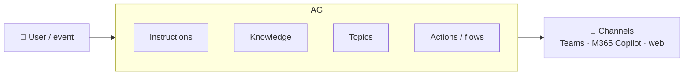

# No-Code Lesson 1 — What is Copilot Studio?

**Track: Build Agents with Copilot Studio · ~20 min · browser only**

## 🎯 Objective
Understand what Copilot Studio is, what an "agent" means in it, and how it maps to
everything you're learning in the code track.

## 🔗 Maps to the code track
This is the no-code mirror of **Phase 1–2**: an LLM brain + instructions + tools +
knowledge, wrapped so it can act and converse.

## 🧠 Concept
**Copilot Studio** is a graphical, low-code tool for building **agents** and **agent
flows**. An *agent* coordinates:
- a **language model** (the brain),
- **instructions** (how it should behave — its system prompt),
- **knowledge sources** (what it knows — no-code RAG),
- **topics** (guided conversation flows),
- **tools / actions** (what it can *do* — connectors & flows),
- **triggers** (what makes it act — a message or an external event).

It understands user intent with natural-language understanding (NLU), then either
follows a **topic** you designed or **generates** an answer from knowledge. You
build agents by *describing them in plain language*, test them, and **publish** to
channels like Teams, Microsoft 365 Copilot, or a website.

## 🛠️ Do it
1. Open **<https://copilotstudio.microsoft.com>** and sign in (start a trial if asked).
2. Take the product tour / open the **Home** page. Notice **Create**, **Agents**,
   **Knowledge**, **Tools**, **Flows**, **Analytics**.
3. (Optional) Try the live demo: **<https://copilotstudio.microsoft.com/tryit>**.

## ✅ Done when
- You can name the 6 ingredients of a Copilot Studio agent.
- You can match three of them to code-track concepts (e.g., instructions = system
  prompt; knowledge = RAG; actions = tools).

## 📝 Reflect
1. Which parts of an agent are "no-code versions" of things you built in Python?
2. When would you reach for Copilot Studio instead of writing an agent from scratch?

## 🔭 Next
Lesson 2: create your first agent just by describing it.
