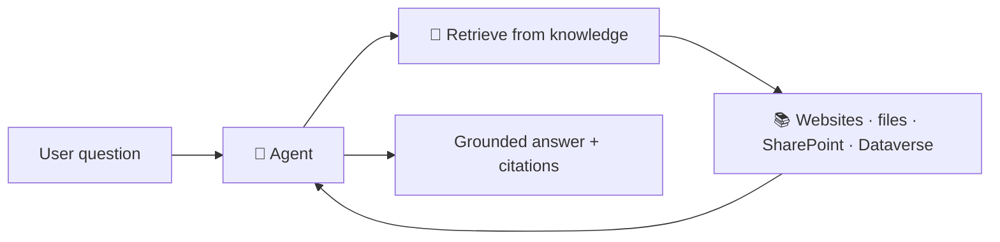

# No-Code Lesson 3 — Knowledge sources = no-code RAG

**Track: Build Agents with Copilot Studio · ~30 min · browser only**

## 🎯 Objective
Ground your agent in real content so it answers from *your* facts — the no-code
version of Retrieval-Augmented Generation.

## 🔗 Maps to the code track
This is **Phase 7 (RAG)** without writing an embedder, vector store, or retriever —
Copilot Studio does retrieval for you behind the scenes.

## 🧠 Concept
**Knowledge sources** are the data your agent can draw on. Once linked, the agent
can **automatically generate conversational answers** from them — you don't have to
author a topic for every question. Typical sources:
- **Public websites** (enter a URL)
- **Uploaded files** (PDF, Word, etc.)
- **SharePoint / OneDrive**
- **Dataverse** and many connectors

This is exactly the RAG idea from the code track: *retrieve the relevant content,
then let the model answer using it* — fully managed.

## 🛠️ Do it
1. Open your agent → **Knowledge** → **Add knowledge**.
2. Add a **public website** (e.g., a docs site or your store's FAQ URL) and/or
   **upload a PDF**.
3. Wait for it to finish processing.
4. In the **Test** pane, ask a question only answerable from that source.
5. Notice **citations**/references in the answer. Then ask something *not* covered
   and see how it responds.

## ✅ Done when
- The agent answers a question using your added source (with a citation).
- You can explain why this is "RAG without code."

## 📝 Reflect
1. How does grounding reduce **hallucination** (Phase 1, Day 9)?
2. What are the trade-offs vs. building your own RAG pipeline in code?

## 🔭 Next
Lesson 4: instructions + generative orchestration — the agent's decision-making.
