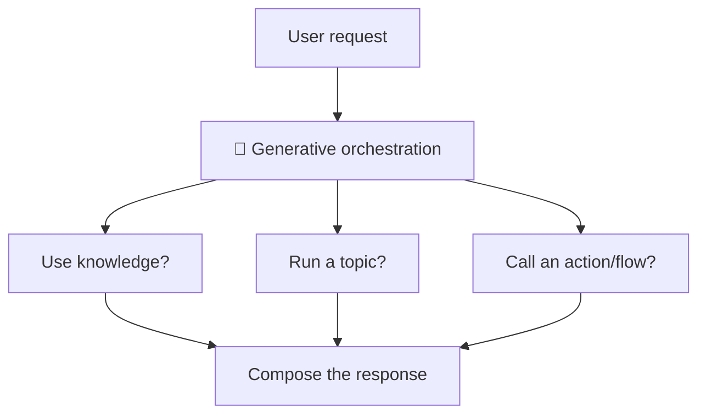

# No-Code Lesson 4 — Instructions & generative orchestration

**Track: Build Agents with Copilot Studio · ~30 min · browser only**

## 🎯 Objective
Shape *how* your agent thinks: write strong **instructions**, and turn on
**generative orchestration** so the agent automatically chooses the right
knowledge, topic, or tool.

## 🔗 Maps to the code track
**Instructions** = the system prompt (Phase 1, Day 5). **Generative orchestration**
= the **agent loop / planner** (Phase 2) — the agent decides what to do each turn,
instead of you wiring every path.

## 🧠 Concept
- **Instructions** are your agent's standing rules: role, tone, what to do, what to
  avoid, and *when to use which tool/knowledge*. Treat them like the most important
  prompt you'll ever write.
- **Generative orchestration** lets the agent **dynamically pick** the best
  topic(s), knowledge source(s), and action(s) to fulfill a request — even chaining
  several — rather than following only hand-built flows. (The alternative,
  *classic orchestration*, follows topics you explicitly design.)

## 🛠️ Do it
1. Open your agent → **Settings** → confirm **Orchestration** is set to
   **Generative** (vs. classic).
2. Open the **Instructions** field and write clear guidance, e.g.:
   > *"Always check the knowledge sources before answering. If a question is about
   > an order, use the order-lookup action. If you don't know, say so and offer to
   > connect a human. Keep answers under 4 sentences."*
3. In **Test**, ask a multi-part question and watch it pull from knowledge and
   (later) actions automatically.

## ✅ Done when
- Orchestration is set to **Generative**.
- Your instructions change *how* and *when* the agent uses knowledge/tools.

## 📝 Reflect
1. How is "instructions tell it when to use which tool" like the **tool catalog** in
   your Day 14 Echo agent's system prompt?
2. When would **classic** (hand-built topics) be safer than generative orchestration?

## 🔭 Next
Lesson 5: design deterministic guided flows with **topics & triggers**.
