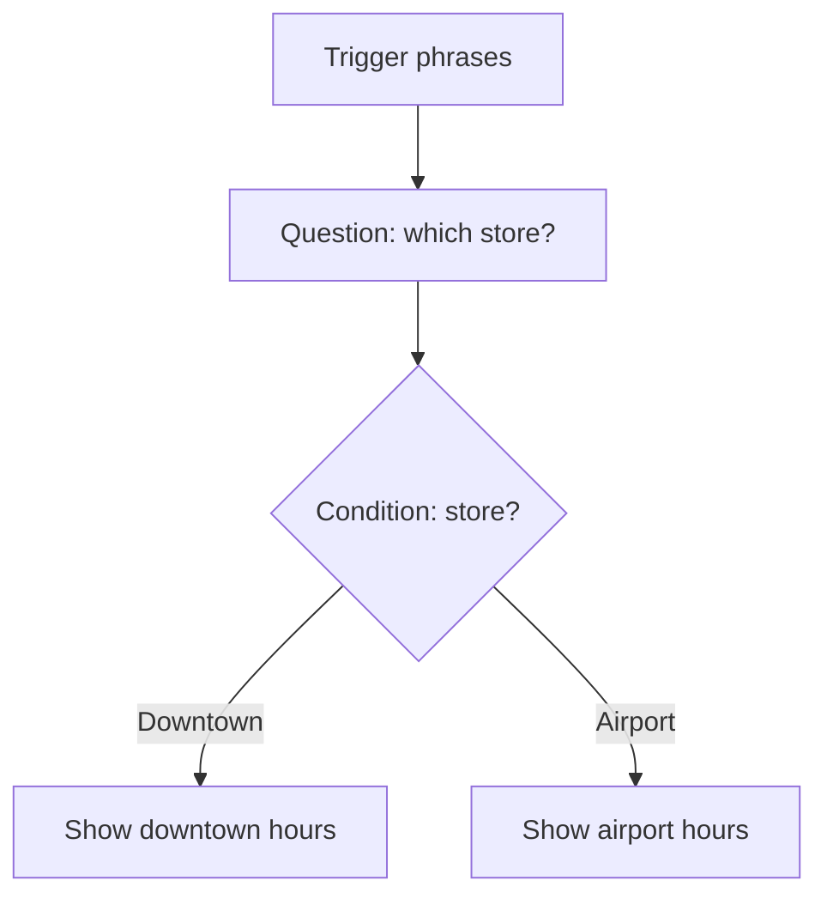

# No-Code Lesson 5 — Topics & triggers (guided flows)

**Track: Build Agents with Copilot Studio · ~35 min · browser only**

## 🎯 Objective
Build a **deterministic** conversation flow with a **topic** — for moments when you
want exact, repeatable steps (not generative free-form).

## 🔗 Maps to the code track
Topics are the no-code cousin of **hand-written deterministic steps** — like the
fixed logic before you handed control to the LLM. Use them where reliability matters
(checkout, eligibility, escalation).

## 🧠 Concept
A **topic** is a portion of a conversation built from connected **nodes**:
- **Trigger phrases** — example utterances that activate the topic (NLU matches
  intent, e.g., "opening hours", "when do you open?").
- **Message** nodes — what the agent says.
- **Question** nodes — collect input into **variables** (and recognize **entities**
  like dates, numbers, emails).
- **Condition** nodes — if/else branching.
- **Action** nodes — call a tool/flow (Lesson 6–7).

## 🛠️ Do it
1. Open your agent → **Topics** → **Add a topic → From blank**.
2. Add **trigger phrases**: "store hours", "when are you open", "opening times".
3. Add a **Question** node ("Which location?") storing the answer in a variable.
4. Add a **Condition** that branches on the variable, then **Message** nodes with
   the hours for each branch.
5. **Save**, then **Test** by typing one of your trigger phrases.

## ✅ Done when
- Your trigger phrases reliably launch the topic.
- The topic branches correctly and uses a **variable**.

## 📝 Reflect
1. When is a deterministic **topic** better than letting the model generate freely?
2. How do **variables/entities** relate to an agent's short-term **memory**
   (code-track Phase 2)?

## 🔭 Next
Lesson 6: give the agent real *powers* — actions & connectors.
