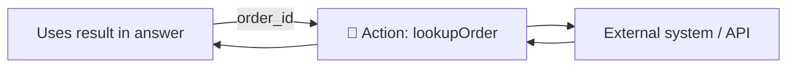

# No-Code Lesson 6 — Actions & connectors = no-code tools

**Track: Build Agents with Copilot Studio · ~35 min · browser only**

## 🎯 Objective
Give your agent the ability to *do things* and fetch live data by adding **actions**
backed by **connectors** — the no-code equivalent of tools/function-calling.

## 🔗 Maps to the code track
This is **Phase 2–3 (tools)**. In code you wrote a `calculator` tool and a registry;
here you add a connector and the agent calls it — with generative orchestration
deciding *when*.

## 🧠 Concept
An **action** lets the agent call an external capability. Copilot Studio connects to
data and systems through **prebuilt or custom connectors**:
- **Prebuilt connectors** — hundreds of services (e.g., SQL, ServiceNow, Salesforce,
  Outlook).
- **Custom connectors / REST & OpenAPI** — wrap your own API.
- **Power Automate flows** — multi-step automation (Lesson 7).
- **MCP** servers — connect tool servers via the Model Context Protocol.

Each action declares **inputs** (what the agent must supply) and **outputs** (what
comes back) — exactly like a tool's arguments and return value. Good **names and
descriptions** matter, because the model reads them to decide when to call it.

## 🛠️ Do it
1. Open your agent → **Tools** (or **Actions**) → **Add a tool**.
2. Pick a **prebuilt connector** you can access (or add a simple **REST/OpenAPI**
   action). Give it a **clear name and description**.
3. Map its **inputs/outputs**; if asked, create/select a **connection**
   (authentication).
4. In **Instructions**, tell the agent when to use it
   (*"To check an order's status, use lookupOrder with the order ID."*).
5. **Test**: ask something that requires the action and confirm it's called.

## ✅ Done when
- The agent calls your action and uses the result in its reply.
- You can explain how an action's inputs/outputs mirror a code tool's args/return.

## 📝 Reflect
1. Why does a clear action **description** matter for generative orchestration?
2. What security questions arise when an agent can call real systems? (Tie to
   Phase 1 Day 9 — prompt injection — and Lesson 9 governance.)

## 🔭 Next
Lesson 7: chain several steps with an **agent flow**.
