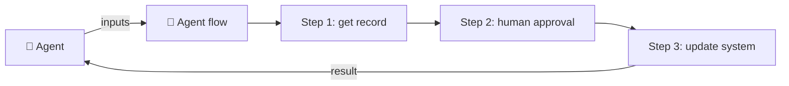

# No-Code Lesson 7 — Agent flows (multi-step automation)

**Track: Build Agents with Copilot Studio · ~35 min · browser only**

## 🎯 Objective
Automate a **multi-step task** with an **agent flow** and let your agent run it as a
tool — including a **human review** step.

## 🔗 Maps to the code track
This is **multi-step tool use / planning** (Phase 3): instead of one tool call, a
whole repeatable procedure the agent can invoke and get results back from.

## 🧠 Concept
**Flows** automate repetitive tasks and integrate apps/services. In Copilot Studio:
- **Agent flows** give a Power Automate-style authoring experience, native to the
  product. (A newer **Workflows** format with a revamped designer is in preview.)
- A flow can **run as a tool** for an agent: the agent passes inputs, the flow runs
  its steps, and returns results to the same agent.
- Flows can **run prompts, call other agents, and include human review steps**.
- Triggers: run **manually**, **on a schedule**, **from an event**, or **from an
  agent**.

## 🛠️ Do it
1. Open your agent → **Flows** (or **Tools → New agent flow**).
2. Build a 2–3 step flow, e.g.: **input** (order id) → **get** order → **email** a
   summary (or post to Teams). Add an **approval / human review** step if available.
3. Define the flow's **inputs and outputs**.
4. Attach the flow to your agent as an **action/tool** and describe when to use it.
5. **Test** end to end from the chat pane.

## ✅ Done when
- The agent triggers the flow, the steps run, and results return to the chat.
- Your flow includes (or you can describe) a human-in-the-loop checkpoint.

## 📝 Reflect
1. When should a step pause for **human approval**? (Tie to operational safety.)
2. How is "flow as a tool" like an agent calling a function that itself orchestrates
   sub-steps?

## 🔭 Next
Lesson 8: let the agent act on its own with **autonomous triggers**.
