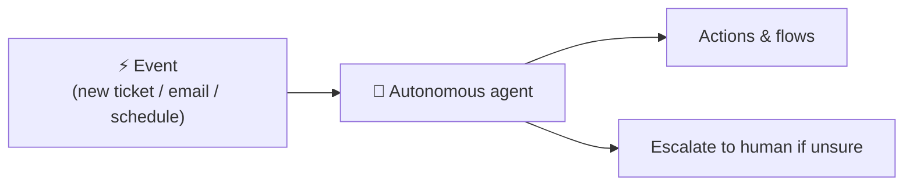

# No-Code Lesson 8 — Autonomous agents & event triggers

**Track: Build Agents with Copilot Studio · ~30 min · browser only**

## 🎯 Objective
Move from "answers when asked" to "**acts when something happens**" — configure a
**trigger** so your agent runs autonomously in reaction to an event.

## 🔗 Maps to the code track
This is **agent autonomy**: the loop runs without a human turn. In code your agent
looped until done; here an external **event** starts the loop and the agent works on
its own using its instructions, knowledge, and tools.

## 🧠 Concept
Agents can **perform tasks in reaction to a trigger**, not just in a chat. An
autonomous agent:
- starts from an **event** (a new record, email, file, schedule, or system signal),
- uses its **instructions** to decide what to do,
- calls **actions/flows** to get work done,
- can **escalate to a human** when needed.

This unlocks back-office automation: triage incoming tickets, summarize and route
documents, enrich CRM records — continuously, without someone typing prompts.

## 🛠️ Do it
1. Open your agent → **Triggers** (or add a trigger from the authoring canvas).
2. Choose an event you can access (e.g., *when a new item is added* to a list, or a
   **scheduled** run).
3. Write **instructions** for the autonomous task
   (*"When a new support email arrives: classify it, draft a reply from knowledge,
   and if it mentions 'refund', create an approval task instead of replying."*).
4. Connect the **actions/flows** it needs.
5. Trigger the event (or wait for the schedule) and review what the agent did.

## ✅ Done when
- An event (not a chat message) causes your agent to take an action.
- Your instructions include a **safe fallback** (escalate / ask for approval).

## 📝 Reflect
1. Why is **prompt-injection** (Phase 1, Day 9) *more* dangerous for an autonomous
   agent that can act on untrusted inputs?
2. What guardrails would you require before letting one run unattended?

## 🔭 Next
Lesson 9: test, moderate, measure, and govern your agent.
