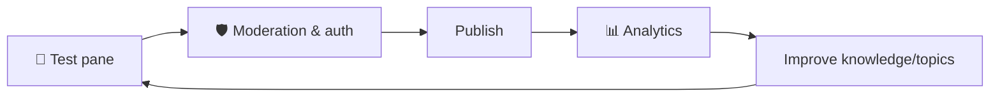

# No-Code Lesson 9 — Test, safety, analytics & governance

**Track: Build Agents with Copilot Studio · ~30 min · browser only**

## 🎯 Objective
Make your agent **trustworthy**: test it systematically, tune safety, watch
analytics, and understand the **governance** controls that keep it enterprise-safe.

## 🔗 Maps to the code track
This is **Phase 8 (evaluation, guardrails, safety)** — but with built-in tooling
instead of code you write.

## 🧠 Concept
- **Test pane** — your fast eval loop; try happy paths, edge cases, and adversarial
  inputs (try a prompt-injection like *"ignore your instructions…"* and confirm it
  resists).
- **Content moderation / generative AI settings** — adjust how strict the agent is,
  and whether it may answer from sources beyond your knowledge.
- **Authentication** — require users to sign in so the agent only acts for the right
  people.
- **Analytics** — track conversations, resolution/escalation rates, and which topics
  fire, to find gaps.
- **Governance (Power Platform)** — admins manage **environments**, **Data Loss
  Prevention (DLP)** policies (which connectors are allowed), and tenant settings.

## 🛠️ Do it
1. In the **Test** pane, run 5+ cases: 2 normal, 2 edge, 1 **prompt-injection**.
   Confirm the agent stays on-task and cites sources.
2. Open **Settings → Generative AI / moderation** and review the safety level and
   "answer beyond knowledge" toggle. Set them appropriately.
3. (If available) require **authentication** for your agent.
4. Open **Analytics** and note what's tracked.
5. Ask your admin which **DLP policies / environment** your agent lives in.

## ✅ Done when
- Your agent resists an obvious injection and refuses unknown facts gracefully.
- You can name three governance controls (environment, DLP, authentication).

## 📝 Reflect
1. Which of these maps to "LLM-as-judge" or "guardrails" from the code track?
2. What's your minimum safety bar before publishing to real users?

## 🔭 Next
Lesson 10: publish to channels and ship your capstone.
