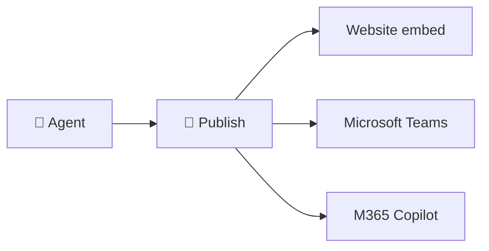

# No-Code Lesson 10 — Publish & deploy + capstone

**Track: Build Agents with Copilot Studio · ~40 min · browser only**

## 🎯 Objective
**Publish** your agent and make it available where people work — then complete a
capstone that uses everything in this track.

## 🔗 Maps to the code track
This is **Phase 8 (deploy)** — but instead of FastAPI + Docker, you click **Publish**
and pick channels.

## 🧠 Concept
Once tested, you **publish** your agent and connect it to one or more **channels**:
- **Demo website** & **custom website** (embed snippet)
- **Microsoft Teams**
- **Microsoft 365 Copilot** (as an agent that extends Copilot)
- **Mobile apps**, **Facebook**, and any channel supported by **Azure Bot Service**

Publishing pushes your latest changes live; you re-publish each time you update the
agent. Each channel may have its own setup (e.g., admin approval for Teams/M365).

## 🛠️ Do it
1. Open your agent → **Publish**.
2. Go to **Channels** and enable the **Demo website** (or custom website); open the
   link and chat with the live agent.
3. (If your tenant allows) enable **Microsoft Teams** and test it there.
4. Re-publish after any change and confirm the update appears.

## 🏁 Capstone — ship a real agent
Build and publish a **"Store Support" agent** that demonstrates the whole track:
- ✅ **Instructions** with a clear persona and rules (Lesson 4)
- ✅ At least **one knowledge source** with grounded, cited answers (Lesson 3)
- ✅ One **deterministic topic** (e.g., returns policy) (Lesson 5)
- ✅ One **action or agent flow** (e.g., order lookup) (Lessons 6–7)
- ✅ Safety tuned + passes your **injection test** (Lesson 9)
- ✅ **Published** to at least one channel (this lesson)

## ✅ Done when
- Your agent is live on a channel and a friend/colleague can use it.
- Your capstone hits all six checkboxes above.

## 📝 Reflect
1. Compare shipping here vs. the code track's deploy phase — speed vs. control.
2. Which parts would you move to **code** (Phases 4–5: frameworks/AutoGen) for more
   control, and which would you keep **no-code**?

## 🎉 Track complete!
You've built and shipped an agent end-to-end with **no code** — and you can map
every piece back to what you built in Python. That dual fluency is rare and
valuable.

**↩ Back to the [main handbook](../README.md) · explore the [No-Code Track index](README.md).**
